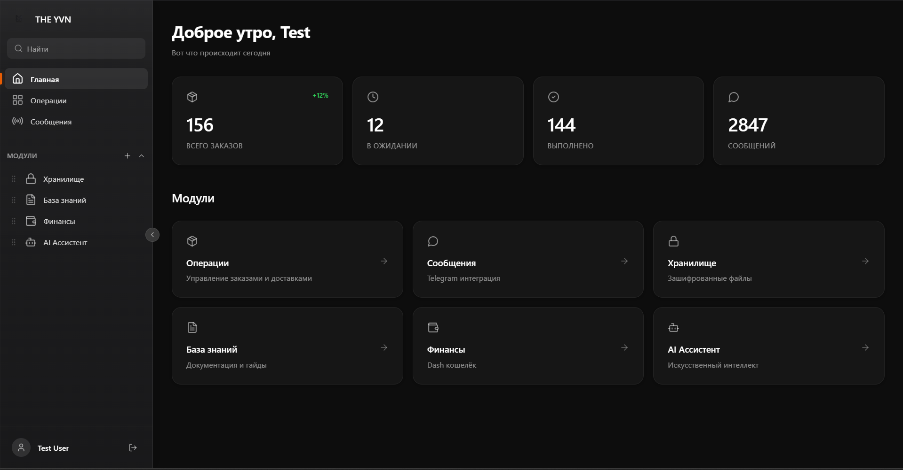
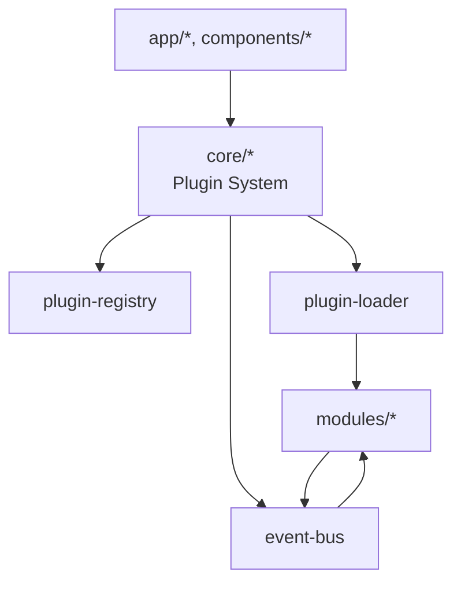

# 🦊 FOX YVN WORKSPACE

<div align="center">


**Современная панель управления бизнесом с плагинной архитектурой.**
**Модули подключаются автоматически, права и события — из коробки.**

</div>

---

## 📸 Скриншоты / Превью



---

## ✨ Возможности

| Иконка | Функция | Описание |
|---|---|---|
| 🔌 | Плагинная архитектура | Модули подключаются через `manifest.json` и `index.ts` |
| 🔐 | Система прав доступа | Контроль доступа на уровне навигации и маршрутов |
| 📡 | Шина событий | События между модулями с историей и отладчиком |
| 📦 | Модульность | Изолированные фичи без прямых зависимостей |
| 🎨 | Современный UI | Apple Music-inspired интерфейс, glassmorphism |

---

## 🏗️ Архитектура

### Общая схема



### Ядро (core/)
- **plugin-loader**: сканирует `modules/`, читает `manifest.json`, импортирует модули
- **plugin-registry**: хранит зарегистрированные модули
- **event-bus**: обмен событиями между модулями
- **permissions**: проверка прав доступа

### Модули (modules/)
- Каждый модуль — отдельная папка с `manifest.json`, `index.ts`, страницами и компонентами.
- Модули общаются через события, не зная друг о друге напрямую.

### Обмен событиями
```
[ops] -> order.created
              ↓
   finance / notifications / analytics
```

---

## 📁 Структура проекта

```
📁 foxyvn-workspace/
├── 📁 app/              ← Next.js страницы
├── 📁 core/             ← Ядро плагинной системы
│   ├── event-bus.ts     ← Шина событий
│   ├── plugin-registry.ts
│   ├── plugin-loader.ts
│   └── permissions.ts
├── 📁 modules/          ← Подключаемые модули
│   ├── 📁 ops/
│   ├── 📁 finance/
│   ├── 📁 mind/
│   ├── 📁 vault/
│   ├── 📁 ai-core/
│   └── 📁 example/
├── 📁 components/       ← UI, провайдеры, guards
├── 📁 contexts/         ← Контекст пользователя
├── 📁 hooks/            ← Хуки (plugins, events, permissions)
└── ...
```

---

## 🚀 Быстрый старт

1) Клонирование
```bash
git clone <repo-url>
cd foxyvn-workspace
```

2) Установка зависимостей
```bash
yarn install
```

3) Настройка .env
```bash
cp .env .env
# Проверьте DATABASE_URL, NEXTAUTH_URL, NEXTAUTH_SECRET
```

4) Инициализация базы данных
```bash
yarn prisma generate
yarn prisma db push
yarn prisma db seed
```

5) Запуск
```bash
yarn dev
```

---

## 🔌 Создание своего модуля

### Структура модуля
```
modules/my-module/
  manifest.json
  index.ts
  components/
    MyModulePage.tsx
```

### manifest.json (все поля)
```json
{
  "name": "my-module",
  "displayName": "Мой модуль",
  "description": "Описание модуля",
  "icon": "package",
  "route": "/modules/my-module",
  "version": "1.0.0",
  "enabled": true,
  "order": 10,
  "dependencies": [],
  "permissions": ["my-module:read", "my-module:write"]
}
```

### index.ts (пример класса)
```ts
import type { PluginManifest, PluginNavItem, PluginRoute } from '@/core/types';
import { BasePlugin } from '@/core/plugin-interface';
import manifestData from './manifest.json';
import MyModulePage from './components/MyModulePage';

const manifest = manifestData as PluginManifest;

class MyModulePlugin extends BasePlugin {
  constructor() {
    super(manifest);
  }

  getRoutes(): PluginRoute[] {
    return [{ path: this.manifest.route, component: MyModulePage }];
  }

  getNavItems(): PluginNavItem[] {
    return [{ id: this.manifest.name, label: this.manifest.displayName, href: this.manifest.route }];
  }
}

export default new MyModulePlugin();
```

### Подписка на события
```ts
import { useEvent } from '@/hooks/use-event-bus';

useEvent<{ orderId: string }>('order.created', (payload) => {
  console.log('Новый заказ:', payload.orderId);
});
```

<details>
<summary>🔎 Подробности о manifest.json</summary>

| Поле | Описание |
|---|---|
| name | Уникальный идентификатор модуля |
| displayName | Имя в интерфейсе |
| description | Краткое описание |
| icon | Иконка (lucide), строка |
| route | URL маршрута |
| version | Версия модуля |
| enabled | Включен ли модуль |
| order | Порядок в навигации (меньше = выше) |
| dependencies | Зависимости от других модулей |
| permissions | Требуемые права |

</details>

---

## 📡 Система событий

### Публикация события
```ts
import { useEventBus } from '@/hooks/use-event-bus';

const { publish } = useEventBus();

publish('order.created', {
  orderId: 'ORD-123',
  amount: 1500,
  customerId: 'cust-1',
});
```

### Подписка на события
```ts
import { useEvent } from '@/hooks/use-event-bus';

useEvent('order.*', (payload) => {
  console.log('Событие заказа:', payload);
});
```

### Стандартные события

| Событие | Payload |
|---|---|
| order.created | { orderId, amount, customerId } |
| order.updated | { orderId, status } |
| order.deleted | { orderId } |
| payment.received | { orderId, amount, method } |
| notification.send | { type, to, message } |
| finance.transaction | { type, amount, category } |

---

## 🔐 Система прав (Permissions)

### Формат прав
`"module:action"` — например `"finance:read"`, `"ops:write"`.

### Защита компонента
```tsx
import { PermissionGuard } from '@/components/permission-guard';

<PermissionGuard required={["finance:read"]}>
  <FinancePage />
</PermissionGuard>
```

### Проверка в коде
```ts
import { usePermissions } from '@/hooks/use-permissions';

const { hasPermission } = usePermissions();
if (hasPermission(["finance:write"])) {
  // do something
}
```

---

## 🛠️ Доступные модули

| Модуль | Описание | Роут | Права |
|---|---|---|---|
| ops | Операции | /modules/ops | ops:read, ops:write |
| vault | Хранилище | /modules/vault | vault:read, vault:write |
| mind | База знаний | /modules/mind | mind:read, mind:write |
| finance | Финансы | /modules/finance | finance:read, finance:write |
| ai-core | AI Ассистент | /modules/ai-core | ai-core:read, ai-core:write |
| example | Пример | /modules/example | example:read |

---

## ⚙️ Конфигурация

- `.env` — переменные окружения
- NextAuth — настройки в `lib/auth-options.ts`
- Prisma — схема в `prisma/schema.prisma`

<details>
<summary>Пример .env</summary>

```env
DATABASE_URL="file:./dev.db"
NEXTAUTH_URL="http://localhost:3000"
NEXTAUTH_SECRET="your-secret"
```

</details>

---

## 📝 Команды

| Команда | Описание |
|---|---|
| `yarn dev` | Запуск dev сервера |
| `yarn build` | Production сборка |
| `yarn start` | Запуск production сборки |
| `yarn lint` | Проверка ESLint |
| `yarn prisma studio` | UI для БД |
| `yarn prisma db push` | Применить схему |
| `yarn prisma db seed` | Сидирование БД |

---

## 🧾 Автор

**FOX YVN** • 2026
